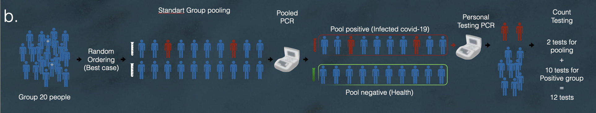

# Matrisk Pooling Algorithm: A Novel Approach to COVID-19 Testing

This repository presents MPA (Matrisk Pooling Algorithm), a new approach to COVID-19 testing, aimed at improving the efficiency of laboratory operations and reducing the spread of the virus by extracting information about the subjects.

## Table of Contents
- [Introduction](#introduction)
- [Abstract Description of the Method](#abstract-description-of-the-method)
- [Data](#data)
- [Features](#features)
- [Installation](#installation)
- [Usage](#usage)
- [Results](#results)
- [Contributing](#contributing)
- [License](#license)

## Introduction
MPA is based on building risk profiles for subjects and placing them in innovative pooling matrices in a precise way that minimizes the number of tests required to identify patients with the virus. This placement method overcomes the structural limitations of traditional pooling methods and allows decision-makers to use the method widely, even with high infection rates in the population, which typically limit the use of pooling.

## Abstract Description of the Method


1. The algorithm receives a daily group of subjects.
2. Instead of placing this group randomly in a pooling table, the MATRISK POOLING algorithm comes into play.
3. Using machine learning tools, the algorithm evaluates the chances of each subject being positive for the disease based on various features.
4. In accordance with this assessment, a risk-based placement is performed within the pooling table. This placement optimizes the need for internal tests, overcoming a structural disadvantage of the traditional pooling method.

## Data
Data base of the Israeli Ministry of Health that includes sex, age, clinical symptoms, demographic data, contact with a verified patient and stay in another country.

## Features
- **Efficient Testing**: Reduces the number of tests required by strategically placing subjects in pooling matrices.
- **High Adaptability**: Effective even with high infection rates, unlike traditional pooling methods.
- **Proven Results**: Tested on real data from the Israeli Ministry of Health with unprecedented results.

## Installation
To install and run MATRISK POOLING, follow these steps:

1. Clone the repository:
   ```bash
   git clone https://github.com/yourusername/matrisk-pooling.git
